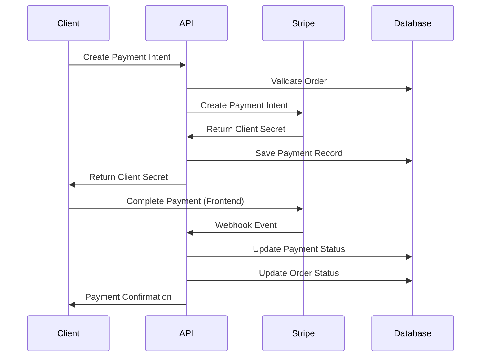
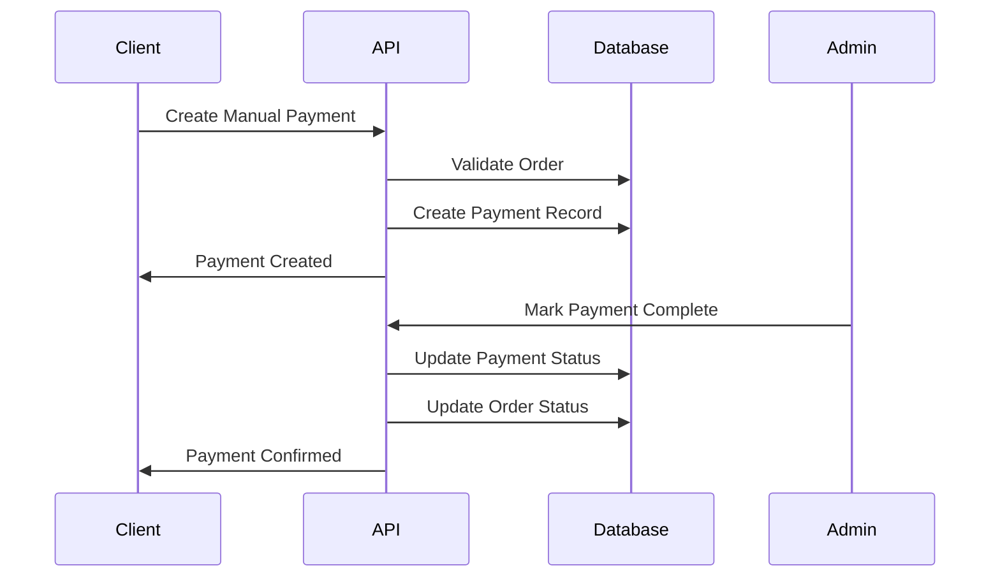

# Payment System Documentation

## Overview

The Txova Marketplace API includes a comprehensive payment system that supports multiple payment methods and provides secure, reliable payment processing. The system is built with TypeScript, integrates with Stripe for online payments, and supports manual payment methods for offline transactions.

## 🏗️ Architecture

### Core Components

1. **Payment Model** (`src/models/Payment.ts`)
   - Comprehensive payment schema with status tracking
   - Virtual properties for status checking
   - Instance methods for payment operations
   - Static methods for payment queries

2. **Payment Service** (`src/services/paymentService.ts`)
   - Business logic for payment processing
   - Stripe integration and webhook handling
   - Refund processing and manual payment management

3. **Payment Controller** (`src/controllers/paymentController.ts`)
   - RESTful API endpoints for payment operations
   - Request validation and error handling
   - Role-based access control

4. **Payment Routes** (`src/routes/payment.ts`)
   - Route definitions with middleware
   - Authentication and authorization
   - Input validation

## 💳 Supported Payment Methods

### 1. Stripe (Online Payments)
- **Supported Cards**: Visa, Mastercard, American Express, Discover
- **Currencies**: USD, EUR, MZN (Mozambican Metical)
- **Features**: 
  - Secure payment processing
  - Real-time payment status updates
  - Automatic fraud detection
  - Webhook integration for instant notifications

### 2. Manual Payments (Offline)
- **Bank Transfer**: Direct bank transfers
- **Cash on Delivery**: Cash payment upon delivery
- **Features**:
  - Manual payment tracking
  - Admin/seller approval workflow
  - Payment completion confirmation

### 3. Future Integrations
- **M-Pesa**: Mobile money integration for Mozambique
- **E-Mola**: Local payment method integration
- **PayPal**: International payment processing

## 🔄 Payment Workflow

### Stripe Payment Flow



### Manual Payment Flow



## 📊 Payment Status Workflow

```
pending → processing → completed
    ↓
failed ← → refunded
```

### Status Descriptions

- **pending**: Payment intent created, awaiting completion
- **processing**: Payment is being processed by gateway
- **completed**: Payment successfully completed
- **failed**: Payment failed or was declined
- **refunded**: Payment was refunded (partial or full)

## 🔐 Security Features

### 1. Stripe Integration Security
- **Webhook Signature Verification**: All webhook events are verified using Stripe's signature
- **API Key Management**: Secure storage of Stripe API keys in environment variables
- **PCI Compliance**: Stripe handles all sensitive payment data (no card data stored locally)

### 2. Payment Data Security
- **No Sensitive Data Storage**: Payment card information is never stored in the database
- **Transaction ID Tracking**: Only Stripe transaction IDs are stored for reference
- **Audit Trail**: Complete audit trail for all payment operations

### 3. Access Control
- **Role-Based Authorization**: Different payment operations require specific roles
- **User Ownership**: Users can only access their own payment information
- **Admin Oversight**: Administrative functions require admin privileges

## 🛠️ API Endpoints

### Payment Intent Management

#### Create Payment Intent
```http
POST /api/v1/payments/create-intent
Authorization: Bearer <token>
Content-Type: application/json

{
  "orderId": "order_id",
  "amount": 99.99,
  "currency": "USD",
  "paymentMethod": "card"
}
```

**Response:**
```json
{
  "success": true,
  "message": "Payment intent created successfully",
  "data": {
    "clientSecret": "pi_xxx_secret_xxx",
    "paymentIntentId": "pi_xxx",
    "amount": 99.99,
    "currency": "USD"
  }
}
```

#### Confirm Payment
```http
POST /api/v1/payments/confirm
Authorization: Bearer <token>
Content-Type: application/json

{
  "paymentIntentId": "pi_xxx"
}
```

### Payment Management

#### Get Payment by ID
```http
GET /api/v1/payments/:paymentId
Authorization: Bearer <token>
```

#### Get User's Payments
```http
GET /api/v1/payments/user/payments
Authorization: Bearer <token>
```

#### Get Payment by Order ID
```http
GET /api/v1/payments/order/:orderId
Authorization: Bearer <token>
```

### Refund Processing

#### Process Refund
```http
POST /api/v1/payments/refund
Authorization: Bearer <token>
Content-Type: application/json

{
  "paymentId": "payment_id",
  "amount": 50.00,
  "reason": "Customer requested refund due to defective product"
}
```

**Required Roles:** admin, seller

### Manual Payments

#### Create Manual Payment
```http
POST /api/v1/payments/manual
Authorization: Bearer <token>
Content-Type: application/json

{
  "orderId": "order_id",
  "amount": 99.99,
  "currency": "USD",
  "method": "cash_on_delivery"
}
```

#### Mark Manual Payment Complete
```http
PATCH /api/v1/payments/manual/:paymentId/complete
Authorization: Bearer <token>
```

**Required Roles:** admin, seller

### Administrative Functions

#### Get Payments by Status
```http
GET /api/v1/payments/status/:status
Authorization: Bearer <token>
```

**Required Roles:** admin

#### Get Payment Statistics
```http
GET /api/v1/payments/statistics/overview
Authorization: Bearer <token>
```

**Required Roles:** admin

### Webhook Endpoint

#### Stripe Webhook
```http
POST /api/v1/payments/webhook/stripe
Content-Type: application/json
Stripe-Signature: <signature>
```

**Note:** This endpoint doesn't require authentication as it's called by Stripe

## 📋 Data Models

### Payment Schema

```typescript
interface IPayment {
  orderId: mongoose.Types.ObjectId;
  userId: mongoose.Types.ObjectId;
  amount: number;
  currency: string;
  method: 'stripe' | 'paypal' | 'bank_transfer' | 'cash_on_delivery';
  status: 'pending' | 'processing' | 'completed' | 'failed' | 'refunded';
  gateway: 'stripe' | 'paypal' | 'manual';
  gatewayTransactionId?: string;
  gatewayResponse?: any;
  refundAmount?: number;
  refundReason?: string;
  refundedAt?: Date;
  createdAt: Date;
  updatedAt: Date;
  
  // Virtual properties
  isPending: boolean;
  isProcessing: boolean;
  isCompleted: boolean;
  isFailed: boolean;
  isRefunded: boolean;
  canRefund: boolean;
  
  // Instance methods
  markAsProcessing(): Promise<IPayment>;
  markAsCompleted(gatewayTransactionId?: string): Promise<IPayment>;
  markAsFailed(error?: any): Promise<IPayment>;
  processRefund(amount: number, reason?: string): Promise<IPayment>;
}
```

### Validation Schemas

#### Create Payment Intent Schema
```typescript
const createPaymentIntentSchema = Joi.object({
  orderId: Joi.string().required(),
  amount: Joi.number().min(0.01).required(),
  currency: Joi.string().length(3).uppercase().default('USD'),
  paymentMethod: Joi.string().valid('card', 'bank_transfer', 'cash_on_delivery').default('card')
});
```

#### Refund Schema
```typescript
const refundPaymentSchema = Joi.object({
  paymentId: Joi.string().required(),
  amount: Joi.number().min(0.01).required(),
  reason: Joi.string().min(10).max(500).required()
});
```

## 🔧 Configuration

### Environment Variables

```bash
# Stripe Configuration
STRIPE_SECRET_KEY=sk_test_xxx
STRIPE_WEBHOOK_SECRET=whsec_xxx

# JWT Configuration
JWT_SECRET=your-jwt-secret

# Database Configuration
MONGODB_URI=mongodb+srv://...
```

### Stripe Setup

1. **Create Stripe Account**
   - Sign up at [stripe.com](https://stripe.com)
   - Complete account verification

2. **Get API Keys**
   - Navigate to Developers → API Keys
   - Copy your publishable and secret keys

3. **Configure Webhooks**
   - Go to Developers → Webhooks
   - Add endpoint: `https://your-domain.com/api/v1/payments/webhook/stripe`
   - Select events: `payment_intent.succeeded`, `payment_intent.payment_failed`, `charge.refunded`
   - Copy webhook signing secret

## 🧪 Testing

### Test Payment Flow

1. **Create Test Order**
```bash
curl -X POST http://localhost:3002/api/v1/test/create-test-order
```

2. **Create Payment Intent**
```bash
curl -X POST http://localhost:3002/api/v1/payments/create-intent \
  -H "Authorization: Bearer <token>" \
  -H "Content-Type: application/json" \
  -d '{
    "orderId": "order_id",
    "amount": 99.99,
    "currency": "USD",
    "paymentMethod": "card"
  }'
```

3. **Test Webhook (using Stripe CLI)**
```bash
stripe listen --forward-to localhost:3002/api/v1/payments/webhook/stripe
```

### Test Cards

Use these test card numbers for testing:

- **Success**: `4242424242424242`
- **Decline**: `4000000000000002`
- **Insufficient Funds**: `4000000000009995`

## 🚨 Error Handling

### Common Error Scenarios

1. **Payment Intent Creation Failed**
   - Invalid order ID
   - Order already has payment
   - Insufficient order amount

2. **Payment Confirmation Failed**
   - Payment intent not found
   - Payment intent status not succeeded
   - Payment record not found

3. **Refund Processing Failed**
   - Payment not found
   - Payment cannot be refunded
   - Refund amount exceeds payment amount

4. **Webhook Verification Failed**
   - Invalid webhook signature
   - Missing webhook secret
   - Invalid event data

### Error Response Format

```json
{
  "success": false,
  "message": "Error description",
  "errors": ["Detailed error messages"]
}
```

## 📈 Monitoring & Analytics

### Payment Statistics

The system provides comprehensive payment statistics:

- **Total Payments**: Count of all payments
- **Payment Status Distribution**: Breakdown by status
- **Success Rate**: Percentage of successful payments
- **Revenue Tracking**: Total revenue by period
- **Refund Rate**: Percentage of refunded payments

### Logging

All payment operations are logged with:
- Timestamp and operation type
- User and order information
- Payment gateway responses
- Error details and stack traces

## 🔄 Integration with Other Systems

### Order System Integration
- Automatic order status updates on payment completion
- Stock management integration
- Order confirmation emails (future)

### User System Integration
- Payment history in user profiles
- Payment method preferences
- Billing address management

### Inventory System Integration
- Stock reservation during payment processing
- Stock release on payment failure
- Stock confirmation on payment success

## 🚀 Future Enhancements

### Planned Features

1. **Additional Payment Methods**
   - M-Pesa integration for mobile money
   - E-Mola integration for local payments
   - PayPal integration for international payments

2. **Advanced Payment Features**
   - Recurring payments and subscriptions
   - Payment plans and installments
   - Multi-currency support
   - Dynamic pricing based on location

3. **Enhanced Security**
   - 3D Secure authentication
   - Advanced fraud detection
   - Payment risk scoring
   - Compliance monitoring

4. **Analytics & Reporting**
   - Real-time payment dashboards
   - Payment performance metrics
   - Revenue forecasting
   - Customer payment behavior analysis

## 📞 Support

For payment system issues:

1. **Check Logs**: Review application logs for error details
2. **Verify Configuration**: Ensure all environment variables are set correctly
3. **Test Webhooks**: Use Stripe CLI to test webhook delivery
4. **Contact Support**: Reach out to the development team for assistance

## 📚 Additional Resources

- [Stripe API Documentation](https://stripe.com/docs/api)
- [Stripe Webhook Guide](https://stripe.com/docs/webhooks)
- [Stripe Testing Guide](https://stripe.com/docs/testing)
- [MongoDB Payment Patterns](https://docs.mongodb.com/manual/data-modeling/)
